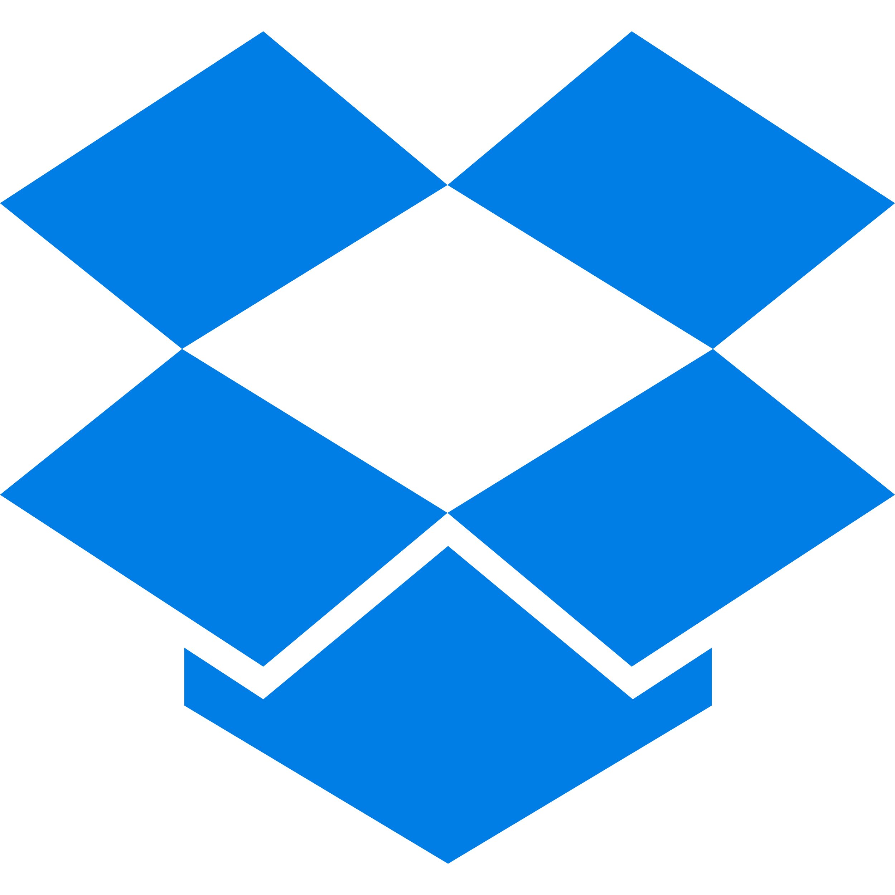

# AeroFTP

<p align="center">
  
</p>

<p align="center">
  <strong>FTP-First. Multi-Protocol. AI-Powered. Encrypted. Privacy-Enhanced.</strong>
</p>

<p align="center">
  The modern FTP client that grew into a complete file management platform. Multi-protocol, 6 integrated product modules, 47 languages, one app.
</p>

<p align="center">
  <a href="https://aeroftp.app">Website</a> · <a href="https://docs.aeroftp.app">Documentation</a> · <a href="https://github.com/axpdev-lab/aeroftp/releases">Download</a>
</p>

<!-- Row 1: Project & Quality -->
<p align="center">
  <a href="https://github.com/axpdev-lab/aeroftp/releases"></a>
  
  <a href="https://www.bestpractices.dev/projects/11994"></a>
  <a href="https://rust-reportcard.xuri.me/report/github.com/axpdev-lab/aeroftp"></a>
</p>

<!-- Row 2: App Features -->
<p align="center">
  
  
  
  
  
  
  
</p>

<!-- Row 3: Tech Stack & OS -->
<p align="center">
  
  
  
  
  
  
  
</p>

<!-- Row 3: Package Managers -->
<p align="center">
  <a href="https://snapcraft.io/aeroftp"></a>
  <a href="https://aur.archlinux.org/packages/aeroftp-bin"></a>
  <a href="https://launchpad.net/aeroftp"></a>
  <a href="https://winstall.app/apps/axpnet.AeroFTP"></a>
  <a href="https://sourceforge.net/projects/aeroftp/"></a>
  <a href="https://github.com/axpdev-lab/aeroftp/issues/177"></a>
</p>

<!-- Row 3: Community & Listings -->
<p align="center">
  <a href="https://openinventionnetwork.com/"></a>
  <a href="https://alternativeto.net/software/aeroftp/"></a>
  <a href="https://buymeacoffee.com/AXPNetwork"></a>
  <a href="https://github.com/sponsors/axpnet"></a>
</p>

---

## Platform Status

| Platform | Status | Packages | Notes |
|----------|--------|----------|-------|
| **Linux** | Stable | `.deb`, `.rpm`, `.snap`, `.AppImage`, AUR | GNOME, KDE Plasma, XFCE, Hyprland, Sway, i3 (X11 & Wayland) |
| **Windows** | Stable | `.msi`, `.exe`, `.zip` portable, winget | Fully tested, not Microsoft Store signed |
| **macOS (Apple Silicon)** | Beta | `.dmg` (aarch64) | Not code-signed, requires `xattr` workaround |

> **macOS note:** The `.dmg` is not yet signed with an Apple Developer ID certificate. macOS Gatekeeper will block it. After installing, run: `sudo xattr -rd com.apple.quarantine /Applications/AeroFTP.app`

---

## FTP-First Design

AeroFTP is an FTP client first. Full encryption support with configurable TLS modes (Explicit AUTH TLS, Implicit TLS, opportunistic TLS), certificate verification control, MLSD/MLST machine-readable listings (RFC 3659), and resume transfers (REST/APPE). It then extends this foundation into a broad multi-protocol file management platform through six integrated product modules - the **Aero Family**.

---

## Integrations

AeroFTP organizes integrations on three tiers, so what you see in the catalog is precise rather than vague:

1. **Transport protocols (7):** native wire-level support for FTP, FTPS, SFTP, WebDAV, S3, Azure Blob, OpenStack Swift.
2. **Native provider integrations (25+):** dedicated OAuth2 / API key / SDK code paths per provider, so each one's specific features (sharing, native delta sync, server-side copy, large-file chunking, media-CDN transformations) are first-class instead of best-effort. Includes the dedicated **media services** tier (ImageKit, Uploadcare, Cloudinary, Immich, Google Photos, PixelUnion).
3. **Pre-configured presets (45+):** server URL, port, base path, password-generation deep-link filled in automatically for compatible services on top of the protocols above (S3-compatible endpoints from MEGA S4 to Filen S5 to MinIO, WebDAV-compatible servers including Nextcloud, Tab.digital, Felicloud, Seafile, InfiniCLOUD, etc.).

<table align="center">
  <!-- Continuous grid: Cloud (OAuth/API) -> S3-Compatible -> WebDAV -> SFTP -> Developer -> Media (last) -->
  <tr>
    <td align="center" width="80"><a href="https://docs.aeroftp.app/providers/google-drive"></a><br><sub>Google Drive</sub></td>
    <td align="center" width="80"><a href="https://docs.aeroftp.app/providers/onedrive"></a><br><sub>OneDrive</sub></td>
    <td align="center" width="80"><a href="https://docs.aeroftp.app/providers/dropbox"></a><br><sub>Dropbox</sub></td>
    <td align="center" width="80"><a href="https://docs.aeroftp.app/providers/mega"></a><br><sub>MEGA</sub></td>
    <td align="center" width="80"><a href="https://docs.aeroftp.app/providers/box"></a><br><sub>Box</sub></td>
    <td align="center" width="80"><a href="https://docs.aeroftp.app/providers/pcloud"></a><br><sub>pCloud</sub></td>
    <td align="center" width="80"><a href="https://docs.aeroftp.app/providers/filen"></a><br><sub>Filen</sub></td>
    <td align="center" width="80"><a href="https://docs.aeroftp.app/providers/internxt"></a><br><sub>Internxt</sub></td>
    <td align="center" width="80"><a href="https://docs.aeroftp.app/providers/zoho"></a><br><sub>Zoho</sub></td>
    <td align="center" width="80"><a href="https://docs.aeroftp.app/providers/koofr"></a><br><sub>Koofr</sub></td>
  </tr>
  <tr>
    <td align="center" width="80"><a href="https://docs.aeroftp.app/providers/kdrive"></a><br><sub>kDrive</sub></td>
    <td align="center" width="80"><a href="https://docs.aeroftp.app/providers/jottacloud"></a><br><sub>Jottacloud</sub></td>
    <td align="center" width="80"><a href="https://docs.aeroftp.app/providers/drime"></a><br><sub>Drime</sub></td>
    <td align="center" width="80"><a href="https://docs.aeroftp.app/providers/filelu"></a><br><sub>FileLu</sub></td>
    <td align="center" width="80"><a href="https://docs.aeroftp.app/providers/opendrive"></a><br><sub>OpenDrive</sub></td>
    <td align="center" width="80"><a href="https://docs.aeroftp.app/providers/yandex"></a><br><sub>Yandex Disk</sub></td>
    <td align="center" width="80"><a href="https://docs.aeroftp.app/providers/4shared"></a><br><sub>4shared</sub></td>
    <td align="center" width="80"><a href="https://docs.aeroftp.app/providers/backblaze-b2"></a><br><sub>Backblaze</sub></td>
    <td align="center" width="80"><a href="https://docs.aeroftp.app/providers/aws-s3"></a><br><sub>AWS S3</sub></td>
    <td align="center" width="80"><a href="https://docs.aeroftp.app/providers/google-cloud-storage"></a><br><sub>Google Cloud</sub></td>
  </tr>
  <tr>
    <td align="center" width="80"><a href="https://docs.aeroftp.app/protocols/azure"></a><br><sub>Azure</sub></td>
    <td align="center" width="80"><a href="https://docs.aeroftp.app/providers/wasabi"></a><br><sub>Wasabi</sub></td>
    <td align="center" width="80"><a href="https://docs.aeroftp.app/providers/cloudflare-r2"></a><br><sub>Cloudflare R2</sub></td>
    <td align="center" width="80"><a href="https://docs.aeroftp.app/providers/digitalocean-spaces"></a><br><sub>DigitalOcean</sub></td>
    <td align="center" width="80"><a href="https://docs.aeroftp.app/providers/tencent-cloud-cos"></a><br><sub>Tencent COS</sub></td>
    <td align="center" width="80"><a href="https://docs.aeroftp.app/providers/alibaba-cloud-oss"></a><br><sub>Alibaba OSS</sub></td>
    <td align="center" width="80"><a href="https://docs.aeroftp.app/providers/oracle-cloud"></a><br><sub>Oracle</sub></td>
    <td align="center" width="80"><a href="https://docs.aeroftp.app/providers/storj"></a><br><sub>Storj</sub></td>
    <td align="center" width="80"><a href="https://docs.aeroftp.app/providers/idrive-e2"></a><br><sub>IDrive e2</sub></td>
    <td align="center" width="80"><a href="https://docs.aeroftp.app/providers/minio"></a><br><sub>MinIO</sub></td>
  </tr>
  <tr>
    <td align="center" width="80"><a href="https://docs.aeroftp.app/providers/yandex-object-storage"></a><br><sub>Yandex Cloud</sub></td>
    <td align="center" width="80"><a href="https://docs.aeroftp.app/providers/mega-s4"></a><br><sub>MEGA S4</sub></td>
    <td align="center" width="80"><a href="https://docs.aeroftp.app/providers/quotaless"></a><br><sub>Quotaless</sub></td>
    <td align="center" width="80"><a href="https://docs.aeroftp.app/providers/nextcloud"></a><br><sub>Nextcloud</sub></td>
    <td align="center" width="80"><a href="https://docs.aeroftp.app/providers/felicloud"></a><br><sub>Felicloud</sub></td>
    <td align="center" width="80"><a href="https://docs.aeroftp.app/providers/tabdigital"></a><br><sub>Tab.digital</sub></td>
    <td align="center" width="80"><a href="https://docs.aeroftp.app/providers/cloudme"></a><br><sub>CloudMe</sub></td>
    <td align="center" width="80"><a href="https://docs.aeroftp.app/providers/infinicloud"></a><br><sub>InfiniCLOUD</sub></td>
    <td align="center" width="80"><a href="https://docs.aeroftp.app/providers/jianguoyun"></a><br><sub>Jianguoyun</sub></td>
    <td align="center" width="80"><a href="https://docs.aeroftp.app/providers/seafile"></a><br><sub>Seafile</sub></td>
  </tr>
  <tr>
    <td align="center" width="80"><a href="https://docs.aeroftp.app/providers/drivehq"></a><br><sub>DriveHQ</sub></td>
    <td align="center" width="80"><a href="https://docs.aeroftp.app/providers/hetzner-storage-box"></a><br><sub>Hetzner</sub></td>
    <td align="center" width="80"><a href="https://docs.aeroftp.app/providers/github"></a><br><sub>GitHub</sub></td>
    <td align="center" width="80"><a href="https://docs.aeroftp.app/providers/gitlab"></a><br><sub>GitLab</sub></td>
    <td align="center" width="80"><a href="https://docs.aeroftp.app/providers/sourceforge"></a><br><sub>SourceForge</sub></td>
    <td align="center" width="80"><a href="https://docs.aeroftp.app/providers/immich"></a><br><sub>Immich</sub></td>
    <td align="center" width="80"><a href="https://docs.aeroftp.app/providers/pixelunion"></a><br><sub>PixelUnion</sub></td>
    <td align="center" width="80"><a href="https://docs.aeroftp.app/providers/imagekit"></a><br><sub>ImageKit</sub></td>
    <td align="center" width="80"><a href="https://docs.aeroftp.app/providers/uploadcare"></a><br><sub>Uploadcare</sub></td>
    <td align="center" width="80"><a href="https://docs.aeroftp.app/providers/cloudinary"></a><br><sub>Cloudinary</sub></td>
  </tr>
</table>

<p align="center">
  <sub>+ FTP, FTPS, SFTP, WebDAV, Swift protocols</sub><br>
  <sub>We reached out directly to providers to ensure quality integration.</sub><br>
  <sub>Special thanks to MEGA, Koofr, FileLu, Felicloud, Storj, pCloud, IDrive, Jottacloud, InfiniCLOUD, and SourceForge for their responsive technical support.</sub>
</p>

<!-- The grid above is curated for layout; the table below is generated from
     src/components/providerCatalog.ts (the single source of truth) and kept in
     sync by a drift-guard test, so this README, aeroftp.app and docs.aeroftp.app
     no longer drift. Regenerate with `npm run gen:providers-table`. See docs/PROVIDERS.md. -->

<details>
<summary><b>Full provider matrix</b> (generated from the catalog, always in sync)</summary>

<!-- BEGIN PROVIDERS-TABLE -->

<!-- Generated from src/components/providerCatalog.ts by `npm run gen:providers-table`. Do not edit by hand. -->

| Provider | HQ | Free tier | Connection methods |
| --- | --- | --- | --- |
| 4shared | VG | 15 GB | OAuth, WebDAV |
| Alibaba OSS | CN | paid plan | S3* |
| Amazon S3 | US | 5 GB 12-month trial | S3* |
| Azure Blob | US | 12-month trial | Blob* |
| Backblaze B2 | US | 10 GB | API, S3 |
| Blomp | US | 20 GB (referral bonus) | Swift |
| Box | US | 10 GB | OAuth |
| Cloudflare R2 | US | 10 GB (egress-free) | S3 |
| Cloudinary | US | credit-based | API |
| CloudMe | SE | 3 GB | WebDAV |
| DigitalOcean Spaces | US | paid plan | S3* |
| Drime | FR | 20 GB | API |
| DriveHQ | US | 1 GB | WebDAV |
| Dropbox | US | 2 GB | OAuth |
| Felicloud | - | Nextcloud host | WebDAV |
| FileLu | US | 1 GB | API, WebDAV, S3 |
| Filen | DE | 10 GB (E2E) | API, S3, WebDAV |
| GitHub | US | repo storage | API |
| GitLab | US | repo storage | API |
| Google Cloud Storage | US | 5 GB (always-free tier) | S3 |
| Google Drive | US | 15 GB | OAuth |
| Hetzner Storage Box | DE | paid plan | SFTP* |
| IDrive e2 | US | 10 GB | S3 |
| ImageKit | IN | 20 GB (media CDN) | API |
| Immich | - | self-hosted | API |
| InfiniCloud | JP | 20 GB | WebDAV |
| Internxt | ES | 1 GB (E2E) | API |
| Jianguoyun | CN | 1 GB (monthly traffic cap) | WebDAV |
| Jottacloud | NO | 5 GB | API |
| kDrive | CH | 15 GB | API |
| Koofr | SI | 10 GB | API, WebDAV |
| MEGA | NZ | 20 GB (E2E) | API, MEGAcmd |
| MEGA S4 Object Storage | EU | Pro plan | S3* |
| MinIO | - | self-hosted | S3 |
| Nextcloud | - | self-hosted | WebDAV |
| OneDrive | US | 5 GB | OAuth |
| OpenDrive | US | 5 GB | API, WebDAV |
| Oracle Cloud | US | 20 GB (always-free) | S3 |
| pCloud | CH | 10 GB | OAuth, WebDAV* |
| PixelUnion | EU | 16 GB (managed Immich) | API |
| Seafile | - | self-hosted | WebDAV |
| SourceForge | US | OSS hosting | SFTP |
| Storj | US | 25 GB (decentralized) | S3 |
| Tab.digital | IN | managed Nextcloud | WebDAV* |
| Tencent COS | CN | paid plan | S3* |
| Uploadcare | US | 3 GB (media CDN) | API |
| Wasabi | US | 30-day trial | S3* |
| Yandex Disk | RU | 5 GB | OAuth, WebDAV |
| Yandex Object Storage | RU | paid plan | S3* |
| Zoho WorkDrive | IN | 5 GB | OAuth |

<sub>50 providers, 61 connection methods. `*` marks a paid / credit-card-gated plan. HQ is the ISO 3166-1 alpha-2 of the company HQ (EU = pan-European). Free-tier sizes are approximate: verify with the provider.</sub>

<!-- END PROVIDERS-TABLE -->

</details>

> See the [protocol features matrix](docs/PROTOCOL-FEATURES.md) for full per-provider capabilities.

### Community Benchmark

Real-world protocol comparisons need real-world data. We do not have a credible basis to claim "protocol X is faster than Y on provider Z" from a single developer machine on a single ISP, so we invite the community to contribute sanitized, privacy-preserving benchmark reports.

Run `aeroftp-cli --profile "My Server" benchmark quick` against any saved profile (the CLI resolves credentials from the encrypted vault, you never paste passwords) and submit the resulting JSON via the dedicated Issue template. The report contains throughput / latency statistics, never hostnames, paths, or credentials.

> Full participation guide and Phase 2 decision gate: **[docs/COMMUNITY-BENCHMARK.md](docs/COMMUNITY-BENCHMARK.md)**. Tracking thread: **[#177](https://github.com/axpdev-lab/aeroftp/issues/177)**.

### Profile Bridge

AeroFTP bridges server profiles with **15 third-party tools**, bidirectionally (import and export), from a unified interface in the GUI (Settings > Export/Import > Bridge) and the CLI (`aeroftp import <tool>` / `aeroftp export <tool>`). Recovered credentials are upgraded into the AES-256-GCM encrypted vault on import and re-encoded into each tool's native format on export. Duplicate detection shows which servers already exist, with the option to update credentials on re-import.

**File-transfer & SSH clients**

| Tool | Config / file | Protocols | Credentials |
|---|---|---|---|
| **rclone** | `rclone.conf` (INI) | 17 backend types | Full (AES-256-CTR, published key) |
| **WinSCP** | `WinSCP.ini` (INI) | SFTP, SCP, FTP, FTPS, WebDAV, S3 | Full (XOR obfuscation) |
| **FileZilla** | `sitemanager.xml` (XML) | FTP, FTPS, SFTP, S3 | Full (Base64) |
| **lftp** | `rc` / bookmarks | FTP, FTPS, SFTP, WebDAV | Limited |
| **Cyberduck** | `.duck` bookmark (plist/XML) | FTP, FTPS, SFTP, WebDAV, S3 | Metadata only (keychain) |
| **MobaXterm** | `MobaXterm.ini` | FTP, FTPS, SFTP, WebDAV, S3 | Limited (host-bound) |
| **PuTTY** | registry `.reg` export | SFTP | Metadata only |
| **OpenSSH** | `ssh config` | SFTP | Metadata only (key / agent) |
| **Dreamweaver** | `.ste` site export (XML) | FTP, FTPS, SFTP, WebDAV, S3 | Full |

**S3 / object-storage tools**

| Tool | Config / file | Protocols | Credentials |
|---|---|---|---|
| **AWS CLI** | `credentials` / `config` (INI) | S3 | Full |
| **MinIO Client (mc)** | `config.json` (JSON) | S3 | Full |
| **s3cmd** | `.s3cfg` (INI) | S3, SFTP, WebDAV | Full |

**Backup tools**

| Tool | Config / file | Protocols | Credentials |
|---|---|---|---|
| **Kopia** | `repository.config` (JSON) | S3, SFTP, WebDAV | Full |
| **restic** | env script (`RESTIC_REPOSITORY` + AWS env) | S3, SFTP, WebDAV | Full |
| **Duplicacy** | `preferences` (JSON) | S3, SFTP, WebDAV | Limited |

> **Credentials:** *Full* = the secret is recovered and upgraded into the vault; *Limited* = only part of the secret material (host-bound or optional); *Metadata only* = connection metadata is imported but the secret stays in the OS keychain / SSH agent / an interactive prompt. The three original tools keep dedicated bridge pages: **[rclone](https://docs.aeroftp.app/features/rclone)**, **[WinSCP](https://docs.aeroftp.app/features/winscp)**, **[FileZilla](https://docs.aeroftp.app/features/filezilla)**.

> **rclone crypt interop (full read/write):** in addition to profile import/export, AeroFTP can browse, decrypt **and re-encrypt** existing `rclone crypt` remotes natively. Upload, download, rename, and delete all stream through a transparent crypto overlay session: the underlying provider sees only encrypted blobs and obfuscated filenames, while the UI shows plaintext paths. See the **[rclone crypt page](https://docs.aeroftp.app/features/rclone-crypt)**.

> **rclone filter conversion:** `aeroftp-cli import rclone-filter <path>` converts an rclone `--filter-from` file (with `+`/`-` rules and `#` comments) into an `.aeroignore` file. Rule order is reversed automatically to preserve rclone's first-match-wins semantics under gitignore last-match-wins. Brace alternation `{a,b}` and `!` reset directives are reported as warnings since they have no direct gitignore equivalent.

### Hosting Provider Integration

Web hosting providers can generate encrypted `.aeroftp` connection profiles from their control panels, so customers can import pre-configured FTP/SFTP connections with a single click - no manual setup, no credentials in plaintext emails.

> See the [Hosting Integration Guide](docs/HOSTING-INTEGRATION.md) for the file format specification, encryption details, and ready-to-use code examples in Python and Node.js.

---

## File Formats

AeroFTP defines four user-facing file formats. Each has a single purpose and a distinct extension; double-click open works for all of them on Windows, macOS, and Linux.

| Extension | Purpose | Encryption | Carries |
|---|---|---|---|
| `.aerovault` | Encrypted container (alternative to Cryptomator / `.zip` / `.rar`) | AES-256-GCM-SIV + Argon2id | Arbitrary files and folders inside a single sealed archive |
| `.aeroftp` | Server-profile export and cross-tool exchange format (bridge with rclone / WinSCP / FileZilla) | AES-256-GCM + Argon2id | Selected saved profiles (host, user, protocol, paths). With *include credentials* on, also per-profile passwords and per-profile OAuth / Jottacloud tokens |
| `.aeroftp-keystore` | Full vault backup | AES-256-GCM + Argon2id | Everything in the vault: every profile, every credential, AI provider keys, app settings, theme and background preferences, AI chats |
| `.aeroftp-script` | Portable batch script for `aeroftp-cli batch` (safer alternative to `.sh` / `.ps1`, runs on every OS where AeroFTP is supported) | None (no secrets) | AeroFTP CLI command lines; references saved profiles by name, never inline credentials |

The first three are encrypted with a user-chosen password at export time. `.aeroftp-script` is plaintext on purpose: it never carries secrets, so it can be checked into a repository, scheduled by cron / Task Scheduler, or shared with a teammate without any vault round-trip.

---

## The Aero Family

```
AeroFTP
├── AeroCloud    - Personal cloud (7 transport protocols + 25+ native providers + 6 media services, sync, share)
├── AeroFile     - Professional file manager (multi-file Properties, recursive search, default-app routing)
├── Mount Manager - Persistent FUSE / WebDAV mounts with cross-platform autostart
├── AeroSync     - Bidirectional sync engine
│   └── AeroRsync    - Native Rust delta sync (clean-room rsync protocol 31)
├── AeroVault    - Military-grade encryption
├── AeroTools    - Code editor + Terminal + AI chat
│   └── AeroAgent    - AI-powered assistant (68 tools, 24 providers)
├── AeroFTP CLI  - Production command-line client (vault profiles, JSON output, batch scripting, daemon, FUSE mount, crypt, ncdu, agent discovery)
└── AeroPlayer   - Media player with visualizers
```

---

### AeroCloud - Your Personal Cloud

> [Full documentation →](https://docs.aeroftp.app/features/aerocloud.html)

Turn **any server** into a private personal cloud. Connect through 7 transport protocols and 25+ native provider integrations with bidirectional sync, selective sync, file versioning, .aeroignore, share links, and per-project folders. Background tray sync with native OS file manager badges (Nautilus, Nemo, Windows Explorer). See the [protocol features matrix](docs/PROTOCOL-FEATURES.md) for full per-provider capabilities.

---

### AeroFile - Professional File Manager

> [Full documentation →](https://docs.aeroftp.app/features/aerofile.html)

A full-featured local file manager built into AeroFTP. Toggle between remote and local modes, or use both side-by-side. Three view modes (list, grid, large icons), Places sidebar with drives and network shares, Quick Look preview (Space), drag-and-drop transfers, batch rename, duplicate finder, disk usage treemap, trash browser, properties dialog with checksums, and 20+ keyboard shortcuts.

**v3.7.1 polish**: aggregate **multi-file Properties** dialog (Windows-style mixed-state indicators across the selection), **recursive `*` flatten search** that lists every descendant under the current directory in one shot, **smart "Open with default app"** routing in the right-click menu (vault containers open in AeroFTP, scripts drop into the AeroTools Terminal with the right shell prefix, anything else goes through the OS), and a **PathBar** with empty-area edit mode plus a trailing chevron dropdown over first-generation subdirectories.

**Dual panel (v3.7.9, Slice A)**: two local panels side by side in AeroFile mode, toggled via the Columns icon in the toolbar or `Ctrl+Shift+D`. Full keyboard parity on the second panel (F2 / Delete / Enter / Backspace / clipboard / Quick Look / properties / arrows / Shift+arrow / Home / End all route to the focused pane; Tab cycles between local and local2). Total-Commander shortcuts: **F5** copies the selection to the other panel, **F6** moves it, **F7** creates a folder in the focused panel. Drag-and-drop between the two panes uses the existing `rename_local_file` / `copy_local_file` backend; Ctrl+drag switches from move (default) to copy. The separator is resizable from mouse and from keyboard (Arrow Left/Right ±10%, Home/End to extremes, Enter/Space to reset to 50/50). Unified tab strip with L / R markers and per-panel persistence. Slice B (each pane configurable as a local path or as a saved remote profile) and Slice C (FreeFileSync-style compare / mirror / backup / bisync workflows on top) follow in their own release windows. Tracked in [issue #162](https://github.com/axpdev-lab/aeroftp/issues/162) section 2.

---

### Mount Manager

> [Full documentation →](https://docs.aeroftp.app/features/mount-manager.html)

Persistent mount manager reachable from File > Mount Manager, the My Servers toolbar, and the connected remote address bar. Save multiple FUSE / WebDAV mount configs (profile, remote path, mountpoint, read-only, cache TTL, allow-other, auto-start) in either a plaintext sidecar JSON (default, daemon-friendly) or in the encrypted vault, toggleable from the dialog header. Per-row Mount / Unmount / Open in file manager / Edit / Delete actions, with a "Pick free drive letter" helper on Windows.

- **Cross-platform autostart**: installs `~/.config/systemd/user/aeroftp-mount-<id>.service` units on Linux (Type=simple, Restart=on-failure) and Task Scheduler ONLOGON entries on Windows. Master-password vault mode blocks autostart with a clear UI explanation since the daemon cannot prompt for a password.
- **Open mount in file manager**: a one-click action on the My Servers context menu that auto-creates a sensible default mount for the selected profile when none exists yet, waits 800 ms for the FUSE / WebDAV layer to settle, then opens the OS file manager at the mountpoint.
- **No secrets in mount configs**: credentials are always resolved by the spawned `aeroftp-cli` through `--profile` against the same vault the GUI uses, mount configs only carry the profile id.

---

### AeroSync - Bidirectional Sync Engine

> [Full documentation →](https://docs.aeroftp.app/features/aerosync.html)

Enterprise-grade file synchronization built for real-world reliability. Three sync profiles (Mirror, Two-way, Backup), conflict resolution center with per-file strategies, SHA-256 checksum verification, transfer journal with checkpoint/resume, configurable retry with exponential backoff, bandwidth control, post-transfer verification (4 policies), and structured error taxonomy with 10 categories. Integrates with AeroCloud for background tray sync.

---

### AeroRsync - Native Rust Delta Sync

> [Full documentation →](https://docs.aeroftp.app/features/aerorsync.html)

Independent clean-room Rust implementation of the rsync wire protocol 31. AeroRsync ships byte-level delta sync without bundling or replacing the `rsync` binary, so cross-platform deployments (Windows first-class) get the same wire-compatible delta transport as Unix.

The delta path is wired into:

- **AeroSync** delta transfers (the original entry point).
- **Cross-Profile Transfer** SFTP to SFTP with key-based auth, so only the bytes that differ from the destination travel on the wire.
- **AeroTools Code Editor** save against a remote SFTP file, so a one-line change to a 5 MB file ships only the diff.

**Session-cached batch transport (v3.7.0)**: a single SSH session amortizes many consecutive delta transfers via the new `AerorsyncBatch` trait: open the session once, transfer N files, close once. `SyncReport` surfaces `delta_files` (per-file delta breakdown) and `bytes_on_wire` so the UI shows exactly which files used the optimized path and the cumulative wire savings. Current scope is SFTP destinations with key-based auth; other providers and the classic `rsync` binary path on Unix coexist on the same `DeltaTransport` trait surface. The Cargo feature `aerorsync` is compiled by default, and the runtime toggle (Settings → Advanced) is ON by default (Auto mode) since v3.8.0, after the cross-platform host-key negotiation asymmetry was resolved. Soft fallbacks (file too small, no key on disk, missing remote helper) silently route back to the classic upload path.

---

### Shaped Graph Transfer (DAG)

> [Full documentation →](docs/DAG-TRANSFER-ENGINE.md)

Since **v4.0.0**, every transfer (single file, batch, sync, cross-profile copy) runs through one shared, provider-agnostic DAG engine. Each transfer is scheduled as a directed acyclic graph of typed nodes (discover, acquire, move bytes, verify, commit, emit progress); concurrency comes from a small set of resource classes (file, chunk, http, disk, api) governed by an AIMD backpressure controller.

The engine picks the right **shape per call** from each provider's capability snapshot:

- **Native multipart fan-out** on S3, Backblaze B2, Google Drive, Dropbox, OneDrive, and Box: one graph node per chunk, orchestrated end-to-end.
- **Server-side copy** on every backend that advertises it (S3 `x-amz-copy-source`, B2 `b2_copy_file`, WebDAV RFC 4918 `COPY`, ImageKit `copyFile`, and 14 more): the bytes never touch the local host. S3 sources above the 5 GiB `CopyObject` limit fan out into parallel `UploadPartCopy` requests.
- **Intra-file segmented downloads** when a provider honours HTTP `Range`.

Backends that advertise none of these degrade honestly to the classic single-stream path, byte-identical with pre-v4.0.0. The GUI, the CLI, and the MCP server schedule through the same runners, so wire-level behavior is identical across all three by construction. The CLI exposes 25+ runtime knobs (`--checkers`, `--s3-upload-concurrency`, `--aimd-min/--aimd-max`, and more) over the same engine.

---

### AeroVault - Military-Grade Encryption

> [Full documentation →](https://docs.aeroftp.app/features/aerovault.html)

[](https://crates.io/crates/aerovault)
[](https://docs.rs/aerovault)

Create, manage, and browse encrypted containers that protect your files with a security stack that exceeds industry standards. The encryption engine is published as the standalone [`aerovault`](https://crates.io/crates/aerovault) crate on crates.io for use in any Rust project.

**AeroVault v2 (.aerovault containers)**

| Component | Algorithm | Details |
| --------- | --------- | ------- |
| **Content encryption** | AES-256-GCM-SIV (RFC 8452) | Nonce misuse-resistant - even nonce reuse doesn't compromise security |
| **Key wrapping** | AES-256-KW (RFC 3394) | Built-in integrity check on unwrap |
| **Filename encryption** | AES-256-SIV | Deterministic - file names are hidden, not just content |
| **Key derivation** | Argon2id | 128 MiB memory / 4 iterations / 4 parallelism (exceeds OWASP 2024) |
| **Header integrity** | HMAC-SHA512 | 512-bit MAC, quantum-resistance margin |
| **Cascade mode** | ChaCha20-Poly1305 | Optional double encryption layer for defense-in-depth |
| **Chunk size** | 64 KB | Per-chunk random nonce + authentication tag |

> **Open format**: The `.aerovault` binary format is fully documented in the [AeroVault v2 Specification](docs/AEROVAULT-V2-SPEC.md) with implementation guides for Rust, Java, Python, Go, C, and JavaScript.

**AeroVault v3 (Beta, v3.8.0)**

A draft container format that ships alongside v2 and is opt-in via the Beta tier in the create dialog. v2 remains the default in the GUI and there is no automatic v2 → v3 migration; the full lifecycle is scriptable from the CLI for every format (`aeroftp-cli vault create/add/info/extract`, `--vault-version v1|v2|v3` with header auto-detect, `--cascade` for the v2 paranoid mode, `--receipt` for the technical telemetry).

| Component | Algorithm | Details |
| --------- | --------- | ------- |
| **Chunking** | Gear-CDC (content-defined) | Variable-size boundaries; same plaintext bytes always produce the same chunk so dedup is stable across edits |
| **Compression** | zstd, per chunk | Three profiles: fast (`-3`), balanced (`-9`), archive (`-19`) |
| **Content encryption** | AES-256-GCM-SIV (RFC 8452) | 96-bit random nonce per chunk + per-chunk AAD bound to block index and chunk id |
| **Chunk addressing** | BLAKE3 keyed, 128-bit | Content-addressed chunk id, also the dedup key |
| **Cipher integrity** | BLAKE3-256 | Pre-decryption check on cipher blocks; load-bearing for the v4 Error Correction layer |
| **Key derivation** | Argon2id | 128 MiB / t=4 / p=4, identical to v2; derives two independent KEKs via HKDF (encryption + MAC) |
| **Key wrapping** | AES-256-KW (RFC 3394) | Two independent random 256-bit working keys, one per KEK |
| **Header integrity** | HMAC-SHA512 | 1024-byte header, MAC verified before any key unwrap |
| **Extension area** | Reserved | Extension directory + payload region used by the v4 Error Correction layer; v3 readers skip non-critical unknown entries, reject critical unknown entries |

The wire layout, the wrapper IDs, and the forward-compat contract (`v3 + Error Correction = v4`, the v3 vault is byte-equivalent to "v4 with Error Correction turned off") are pinned in the [AeroVault v3 Specification](docs/AEROVAULT-V3-SPEC.md). Tracked in [issue #162](https://github.com/axpdev-lab/aeroftp/issues/162) section 4 / T-AEROVAULT-ECC.

**AeroVault v4 (v3 + Error Correction)**

v4 is not a new container format, it is v3 plus a Reed-Solomon Error Correction layer, so a v3 reader still opens a v4 vault (it ignores the parity). Recovery data can be **embedded** in the container, kept in a **detached** sibling sidecar that leaves the encrypted container byte-identical, or **both**.

| Component | Algorithm | Details |
| --------- | --------- | ------- |
| **Recovery codec** | Reed-Solomon (fixed grid) | Per-shard 16-byte truncated BLAKE3 localizes rot so only damaged shards are erased and rebuilt; a bad parity shard is detected and routed around |
| **Detached sidecar** | `.aerocorrect` (magic `AEROCORR`, format v2) | One unified, content-SHA-bound recovery format shared by the vault and AeroSync; protects any byte stream, par2-style |
| **Self-healing** | Triplicated locator + per-copy checksums | A lightly-corrupted sidecar still recovers; the bulk parity has no wholesale checksum because each shard self-checks |
| **Overhead levels** | Low ~7% / Medium ~15% / Quartile ~25% / High ~30% (or 5-50%) | Selectable target; the exact grid is stored in the payload so reconstruction is level-agnostic |
| **Repair contract** | Fail-closed, all-or-nothing | Rebuilt bytes are re-verified against the authenticated header MAC / manifest `cipher_hash` before the vault is persisted, so a foreign or corrupt sidecar can only make repair fail, never overwrite good data |

Exposed in the AeroVault GUI (create with Error Correction, scrub, repair) and the CLI (`vault create --error-correction`, `vault scrub`, `vault repair`, `export-parity`, `strip-parity`; the standalone `correct gen/verify/repair`; `sync --error-correction`). The `.aerocorrect` format is documented in [AeroVault v3 Specification section 11](docs/AEROVAULT-V3-SPEC.md#11-v4-evolution-note-t-aerovault-ecc-shipped) and is byte-identical with the standalone [`aerovault` crate](https://crates.io/crates/aerovault).

**Additional encryption features**:
- **Overlay session model (v3.7.0)**: open an `.aerovault` once, then route every list/upload/download/rename through the encrypted overlay transparently. The provider sees only opaque vault chunks; the UI shows plaintext entries and folders. A status badge in the header marks when the overlay is active.
- **Directory support**: Create nested folders inside vaults with encrypted directory entries, hierarchical navigation, and recursive delete
- **Cryptomator**: Create and browse Cryptomator format 8 vaults (scrypt + AES-SIV + AES-GCM) via context menu
- **Archive Browser**: Browse ZIP, 7z, TAR, RAR contents in-app without extracting. Selective single-file extraction
- **Archive Encryption**: ZIP and 7z with AES-256 password protection. Compression levels (Store/Fast/Normal/Maximum)

---

### AeroTools - Code Editor, Terminal & AI Chat

> [Full documentation →](https://docs.aeroftp.app/features/aerotools.html)

Integrated development panel with three tools in a tabbed interface: **Monaco Editor** (VS Code engine, 50+ languages, remote file editing), **SSH Terminal** (8 themes, multiple tabs), and **AeroAgent AI Chat** with bidirectional editor sync.

#### AeroAgent - AI-Powered Assistant

An AI assistant with **68 tools** that work across local files and remote providers. Supports **24 AI providers** (OpenAI, Anthropic, Gemini, xAI, Ollama, DeepSeek, Mistral, Cerebras, SambaNova, Fireworks, Nvidia, and 13 more). Vision/multimodal, RAG indexing, plugin ecosystem, streaming responses, multi-step autonomous execution, native MCP server mode (34 MCP tools), and Command Palette (Ctrl+Shift+P).

---

### Agent-Ready by Design

> [Full documentation →](https://docs.aeroftp.app/features/agent-ready.html)

AeroFTP is built for both humans and AI agents. As agentic AI, computer use, and autonomous coding assistants become the standard way to interact with computers, AeroFTP provides native interfaces for both use cases.

**For AI Agents (CLI)**: Tools like Claude Code, Open Interpreter, Cline, Aider, Devin, Codex, Cursor Agent, Windsurf, and other agentic frameworks can call `aeroftp-cli` directly. Structured `--json` output, vault-based `--profile` credentials (agents never see passwords), semantic exit codes, and `.aeroftp-script` batch files make AeroFTP a first-class tool in any agent's toolkit. External agents can also invoke `aeroftp-cli agent` to orchestrate AeroAgent as a credential-isolating proxy for multi-server operations. See [Agent Orchestration](https://docs.aeroftp.app/features/agent-orchestration) for the full orchestration guide, CLI reference, and a verified field test report.

**For Humans (GUI + AeroAgent)**: The desktop app provides drag-and-drop file management with AeroAgent, the integrated AI assistant offering 68 tools across local files and remote providers. AeroAgent supports multi-step autonomous execution, tool approval workflows with backend-enforced grants, and 24 AI providers.

---

### AeroFTP CLI - Command-Line Client

> [Full documentation →](https://docs.aeroftp.app/cli/installation.html)

Production CLI sharing the same Rust backend as the GUI. 77 top-level commands (several grouping their own subcommands: `daemon`, `jobs`, `vault`, `crypt`, `import`/`export`, `serve`, `users`) across 7 transport protocols and 25+ native provider integrations, encrypted vault profiles, JSON output, batch scripting, daemon mode with job queue, FUSE filesystem mounting, ncdu TUI explorer, zero-knowledge crypt overlay, single-file AeroVault containers (`vault`, all formats v1/v2/v3), recursive used-storage scan (`df --scan`) with a manual total-cap override, and native MCP server mode for AI integration.

> **Short invocation**: every package ships a native dispatcher, so `aeroftp <subcommand>` and the built-in 4-character name `aftp` both route to the CLI; `aeroftp-cli` is kept for back-compat. An opt-in `aero` alias can be enabled with `aeroftp-cli alias-toggle aero` (idempotent, the same command turns it off). See the [Short Invocation](docs/CLI-GUIDE.md#short-invocation) section of the CLI Guide.

```bash
aeroftp-cli ls --profile "My Server" /var/www/ -l        # Vault profile (no credentials exposed)
aeroftp-cli get sftp://user@host "/data/*.csv"            # Glob download
aeroftp-cli check --profile "My Server" /local /remote --checksum  # Verify local matches remote
aeroftp-cli sync --profile "My Server" /local /remote --watch      # Continuous bidirectional sync
aeroftp-cli serve http sftp://user@host /data             # Serve remote as local HTTP
aeroftp-cli serve webdav s3://key:secret@s3.aws.com       # Serve remote as local WebDAV
aeroftp-cli agent --mcp                                   # MCP server for Claude/Cursor/VS Code
aeroftp-cli mount sftp://user@host /mnt/remote             # FUSE filesystem
aeroftp-cli ncdu sftp://user@host /data                    # Interactive disk usage
aeroftp-cli daemon start                                   # Background job queue
```

**Key features**: `--profile` credential isolation for AI agents, `--json` structured output, semantic exit codes (0-11), `.aeroftp-script` batch files, `check` / `cryptcheck` for local-vs-remote verification (size/checksum against cleartext or encrypted remotes), `dedupe` / `cleanup` for orphan management, `hashsum` for remote file hashing (sha256/md5/blake3), `link` for shareable URLs, `--bwlimit "08:00,512k 18:00,off"` time-based bandwidth schedule (local time), `serve http/webdav/ftp/sftp`, MCP server mode, `--immutable` append-only mode, `--files-from` selective transfers, `--fast-list` S3 optimization, bisync with `--conflict-mode rename`, `NO_COLOR` compliant. See the **[CLI Guide](https://docs.aeroftp.app/cli/installation.html)** and **[Credential Isolation](https://docs.aeroftp.app/credential-isolation)** docs.

**MCP server (34 tools)**: curated tools for agents covering safe / medium / destructive operation tiers: file ops (`aeroftp_list_files`, `aeroftp_read_file`, `aeroftp_upload_file`), batch (`aeroftp_delete_many`, `aeroftp_upload_many`), tree sync (`aeroftp_sync_tree` with per-file `delta_files[]` + `plan[]`), tree diff (`aeroftp_check_tree` with two-sided checksum + per-group caps + `omit_match`), preflight (`aeroftp_sync_doctor`, `aeroftp_reconcile`, `aeroftp_dedupe`), cross-profile copy (`aeroftp_transfer`, `aeroftp_transfer_tree` between two saved profiles in one batch), agent ergonomics (`aeroftp_agent_connect`, `aeroftp_speed`, `aeroftp_touch`, `aeroftp_cleanup`), and pool introspection (`aeroftp://connections` resource + `aeroftp_close_connection`). Real-time `notifications/progress` during uploads, downloads, and sync. The pool auto-recovers from transport-level failures (stale FTP data channels, broken pipes) without manual intervention. Pool reuse gives roughly **14x speedup** vs CLI cold-start on warm calls (measured 13-14 ms vs ~194 ms on Docker SFTP). Run `aeroftp-cli mcp` and plug it into Claude Desktop, Cursor, Windsurf, or VS Code via the [`axpdev-lab.aeroftp-mcp` extension](https://marketplace.visualstudio.com/items?itemName=axpdev-lab.aeroftp-mcp).

---

### AeroPlayer - Media Engine

> [Full documentation →](https://docs.aeroftp.app/features/aeroplayer.html)

Built-in media player with 14 GPU-accelerated visualizer modes (Canvas 2D + WebGL 2 shaders), 10-band graphic EQ with presets, beat detection, and post-processing effects. Zero dependencies - native HTML5 Audio + Web Audio API.

---

## Privacy-Enhanced

AeroFTP incorporates privacy protections that go beyond what traditional file managers offer.

| Feature | Details |
| ------- | ------- |
| **Master Password** | Optional Argon2id vault encryption - all credentials locked behind a single password |
| **Multi-User Account Partition** | Optional per-user vault partitions (Argon2id-derived keys, AES partition encryption) with a boot-time Account Lock Screen, per-user profiles and AeroSync settings, an opt-in admin role with a last-admin guard, and a CLI `--user` flag. Single-user installs are unchanged; migration from an older keystore is automatic and idempotent. New in v4.0.0 |
| **Encrypted Vault** | All sensitive data in AES-256-GCM encrypted storage - zero plaintext on disk |
| **Zero Telemetry** | No analytics, no phone-home, no network requests beyond user-initiated connections |
| **Memory Zeroization** | Passwords and keys cleared from RAM immediately after use |
| **Clearable History** | One-click clear for recent locations. No persistent browsing traces |
| **Portable Deployment** | AppImage runs without installation. Remove it and the config directory - no traces remain |

See [SECURITY.md](SECURITY.md) for the security policy and architecture summary, and [docs.aeroftp.app/security](https://docs.aeroftp.app/security/overview) for the complete security documentation with encryption specs, AI security model, supply chain details, and audit history.

### Self-Hosted Continuous Audit

AeroFTP runs its own vulnerability audit pipeline that does not depend on any vendor SaaS. The pipeline aggregates three independent advisory databases (RustSec, npm registry, Google OSV) and cross-references findings against a documented suppression list with written rationales for every accepted advisory.

```bash
npm run security:report        # generate HTML report
npm run security:report -- --json    # machine-readable output
```

Output is published in [`docs/security/security-report-latest.html`](docs/security/security-report-latest.html). The script and suppression list ([`src-tauri/.cargo/audit.toml`](src-tauri/.cargo/audit.toml)) are part of the repository and run identically on any developer machine and in CI.

| Month | Version | Open | Suppressed (justified) | Notes |
|---|---|---|---|---|
| May 2026 | v3.7.5 | **0** | 25 | Closed CVE-2026-42184 (tauri origin confusion), GHSA-2p6r-x3vv-xqm2 (rpassword), 2x openssl GHSA |

Each month we publish the run results here. Past Aikido Security reports remain linked in the Security Posture table below for archive.

### Security Posture

| Area | Details |
|---|---|
| **Self-Hosted Audit** | `cargo audit` + `npm audit` + `osv-scanner` aggregator with documented suppression list - **0 open findings** ([latest report](docs/security/security-report-latest.html)) |
| **OpenSSF Best Practices** | [100% passing](https://www.bestpractices.dev/projects/11994) - all 67 criteria met |
| **Aikido Security** | Past audits archived - **Top 5% benchmark**, 0 open issues during trial period (Feb-May 2026) |
| **Socket.dev** | Supply chain SCA monitoring on every push - dependency risk scoring, typosquatting detection |
| **Snyk** | Continuous vulnerability scanning for npm and Cargo dependencies with automated fix PRs |
| **CodeRabbit** | AI-driven pull-request review on every PR - inline code suggestions, secret/PII checks, complement to the SAST/SCA stack |
| **Dependabot** | GitHub-native dependency alerts and auto-PRs cross-referenced against the self-hosted audit list |
| **Dependency Scanning** | 1,434 packages monitored (303 JS + 1,131 Rust), daily automated scans |
| **Supply Chain** | All GitHub Actions pinned to SHA hashes, Dependabot enabled, [Sigstore](https://sigstore.dev) signing with client-side verification |
| **Compliance** | Verified against OWASP Top 10, ISO 27001, CIS, NIS2, GDPR - 0 open issues ([March 2026 audit](docs/Security%20Audit%20Report%20axpdev-lab%20-%20March%202026.pdf)) |
| **Security Audits** | 300+ findings resolved across [9 independent audits](https://docs.aeroftp.app/security/audits) - grade A- |
| **Past Aikido Reports** | [March 2026](docs/Security%20Audit%20Report%20axpdev-lab%20-%20March%202026.pdf) - [February 2026](docs/Security%20Audit%20Report%20axpnet%20-%20February%202026.pdf) |

---

## Additional Features

### 4 Themes
Light, Dark, Tokyo Night, and Cyber - with themed icons, terminal colors, Monaco editor syntax, and CSS custom properties throughout.

### Security Toolkit (Cyber theme)
Hash Forge (MD5, SHA-1, SHA-256, SHA-512, BLAKE3), CryptoLab (AES-256-GCM, ChaCha20-Poly1305 encrypt/decrypt), Password Forge (CSPRNG + BIP39 passphrase generator with entropy display).

### 47 Languages at 100% Coverage

Quality-audited translations with native script integrity. Automatic browser language detection.

<table align="center">
  <tr>
    <td align="center">:gb: English</td>
    <td align="center">:it: Italian</td>
    <td align="center">:de: German</td>
    <td align="center">:es: Spanish</td>
    <td align="center">:fr: French</td>
  </tr>
  <tr>
    <td align="center">:portugal: Portuguese</td>
    <td align="center">:ru: Russian</td>
    <td align="center">:jp: Japanese</td>
    <td align="center">:kr: Korean</td>
    <td align="center">:cn: Chinese</td>
  </tr>
  <tr>
    <td align="center">:india: Hindi</td>
    <td align="center">:bangladesh: Bengali</td>
    <td align="center">:tr: Turkey</td>
    <td align="center">:poland: Polish</td>
    <td align="center">:netherlands: Dutch</td>
  </tr>
  <tr>
    <td align="center">:sweden: Swedish</td>
    <td align="center">:denmark: Danish</td>
    <td align="center">:norway: Norwegian</td>
    <td align="center">:finland: Finnish</td>
    <td align="center">:iceland: Icelandic</td>
  </tr>
  <tr>
    <td align="center">:czech_republic: Czech</td>
    <td align="center">:hungary: Hungarian</td>
    <td align="center">:romania: Romanian</td>
    <td align="center">:ukraine: Ukrainian</td>
    <td align="center">:greece: Greek</td>
  </tr>
  <tr>
    <td align="center">:thailand: Thai</td>
    <td align="center">:vietnam: Vietnamese</td>
    <td align="center">:indonesia: Indonesian</td>
    <td align="center">:malaysia: Malay</td>
    <td align="center">:philippines: Filipino</td>
  </tr>
  <tr>
    <td align="center">:cambodia: Khmer</td>
    <td align="center">:georgia: Georgian</td>
    <td align="center">:armenia: Armenian</td>
    <td align="center">:bulgaria: Bulgarian</td>
    <td align="center">:croatia: Croatian</td>
  </tr>
  <tr>
    <td align="center">:serbia: Serbian</td>
    <td align="center">:slovakia: Slovak</td>
    <td align="center">:slovenia: Slovenian</td>
    <td align="center">:macedonia: Macedonian</td>
    <td align="center">:estonia: Estonian</td>
  </tr>
  <tr>
    <td align="center">:lithuania: Lithuanian</td>
    <td align="center">:latvia: Latvian</td>
    <td align="center">:wales: Welsh</td>
    <td align="center">Catalan</td>
    <td align="center">Galician</td>
  </tr>
  <tr>
    <td align="center">Basque</td>
    <td align="center">:kenya: Swahili</td>
    <td align="center"></td>
    <td align="center"></td>
    <td align="center"></td>
  </tr>
</table>

### Auto-Updater
- In-app download with progress bar showing speed and ETA
- "Install & Restart" for .deb, .rpm, and AppImage - detached relaunch survives parent exit
- Non-intrusive update toast with auto-dismiss (StatusBar badge for persistent access)
- Periodic background check every 24 hours

---

## Installation

### Linux

#### Snap Store
```bash
sudo snap install aeroftp
```

<p align="center">
  <a href="https://snapcraft.io/aeroftp">
    
  </a>
</p>

> **Note:** Snap has limited filesystem access due to strict confinement. For full access, use .deb, .AppImage, or AUR.

#### AUR (Arch Linux)
```bash
yay - S aeroftp-bin
# or
paru - S aeroftp-bin
```

<p align="center">
  <a href="https://aur.archlinux.org/packages/aeroftp-bin">
    
  </a>
</p>

> Available on Arch Linux and derivatives (Manjaro, EndeavourOS, Garuda). Binary package - no compilation needed.

#### Launchpad PPA (Ubuntu / Debian)

Visit [launchpad.net/aeroftp](https://launchpad.net/aeroftp) for PPA instructions and .deb packages.

#### Other Linux Formats
Download from [GitHub Releases](https://github.com/axpdev-lab/aeroftp/releases/latest):
- **.deb** - Ubuntu, Debian, Linux Mint, Pop!_OS
- **.rpm** - Fedora, openSUSE, RHEL
- **.AppImage** - Portable, runs on any distro ([AppImageHub](https://appimage.github.io/AeroFTP/))

### Windows

#### Winget
```powershell
winget install axpnet.AeroFTP
```

<p align="center">
  <a href="https://winstall.app/apps/axpnet.AeroFTP">
    
  </a>
</p>

> Available on Windows 10 (1709+) and Windows 11. Requires [App Installer](https://apps.microsoft.com/detail/9NBLGGH4NNS1) from Microsoft Store.

#### Other Windows Formats
Download from [GitHub Releases](https://github.com/axpdev-lab/aeroftp/releases/latest):
- **.exe** - NSIS installer
- **.msi** - Windows Installer

> **Note:** Windows builds are not currently published on the Microsoft Store. The installer is not code-signed (no EV certificate), so Windows SmartScreen may show a warning on first run - this is safe to dismiss.

### macOS

Download from [GitHub Releases](https://github.com/axpdev-lab/aeroftp/releases/latest):
- **.dmg** - Universal disk image

> **Note:** The macOS build is not notarized (no Apple Developer certificate). macOS Gatekeeper will block the app on first launch - right-click the app and select "Open" to bypass. See [#47](https://github.com/axpdev-lab/aeroftp/issues/47) for known issues on Apple Silicon.

### Verifying Release Integrity

All release artifacts are signed with [Sigstore](https://sigstore.dev) using keyless signing via GitHub OIDC. Each release includes `.sigstore.json` verification bundles.

Install [cosign](https://docs.sigstore.dev/cosign/system_config/installation/), then verify any downloaded artifact:

```bash
cosign verify-blob \
  --bundle AeroFTP_3.1.3_amd64.deb.sigstore.json \
  --certificate-identity "https://github.com/axpdev-lab/aeroftp/.github/workflows/build.yml@refs/tags/v3.1.3" \
  --certificate-oidc-issuer "https://token.actions.githubusercontent.com" \
  AeroFTP_3.1.3_amd64.deb
```

This proves the artifact was built by our CI pipeline from the tagged commit. Replace filenames and version with your download.

---

## Support the Project

AeroFTP is free and open source software. If you find it useful, please consider supporting its development:

### Donate

- **GitHub Sponsors**: [github.com/sponsors/axpnet](https://github.com/sponsors/axpnet)
- **Buy Me a Coffee**: [buymeacoffee.com/axpnet](https://buymeacoffee.com/axpnet)

### Cryptocurrency

- **Bitcoin (BTC)**: `bc1qdxur90s5j4s55rwe9rc9n95fau4rg3tfatfhkn`
- **Ethereum (ETH/EVM)**: `0x08F9D9C41E833539Fd733e19119A89f0664c3AeE`
- **Solana (SOL)**: `25A8sBNqzbR9rvrd3qyYwBkwirEh1pUiegUG6CrswHrd`
- **Litecoin (LTC)**: `LTk8iRvUqAtYyer8SPAkEAakpPXxfFY1D1`

### Contributing

Contributions are welcome. Please open an issue to discuss proposed changes before submitting a pull request.

---

## License

GPL-3.0 - See [LICENSE](LICENSE) for details.

---

<p align="center">
  <a href="https://www.bestpractices.dev/projects/11994"></a>
</p>

<table align="center">
  <tr>
    <td align="center">
      <a href="https://openinventionnetwork.com/"></a>
    </td>
    <td align="center">
      <a href="https://opensource.org"></a>
    </td>
    <td align="center">
      <a href="https://sigstore.dev"></a>
    </td>
  </tr>
  <tr>
    <td align="center"><sub>OIN 2.0 Community Member</sub></td>
    <td align="center"><sub>OSI Individual Member</sub></td>
    <td align="center"><sub>Sigstore Signed Releases</sub></td>
  </tr>
  <tr>
    <td align="center">
      <a href="https://aikido.dev"></a>
    </td>
    <td align="center">
      <a href="https://snyk.io"></a>
    </td>
    <td align="center">
      <a href="https://socket.dev"></a>
    </td>
    <td align="center">
      <a href="https://www.coderabbit.ai"></a>
    </td>
  </tr>
  <tr>
    <td align="center"><sub>Aikido Security</sub></td>
    <td align="center"><sub>Snyk</sub></td>
    <td align="center"><sub>Socket.dev</sub></td>
    <td align="center"><sub>CodeRabbit</sub></td>
  </tr>
</table>

<p align="center">
  <em>Built with Rust (Tauri 2) + React 18 + TypeScript</em>
</p>

---

<!-- Platform Status Badges -->
<p align="center">
  
  
  
  
  
</p>

<p align="center">
  <sub>
    Designed, architected and maintained by <a href="https://github.com/axpnet">axpnet</a>.<br>
    AI tools (Claude Code, Codex, Gemini) were used extensively for translations, code review,<br>
    implementation and documentation, always under strict human-defined specifications and patterns.<br>
    Every feature, design decision and architectural choice is human-driven.<br>
    AI accelerated development; it did not direct it.<br>
    <a href="AI-TRANSPARENCY.md">Full AI Transparency Statement</a>
  </sub>
</p>
